# VBA Native Messaging PoC

## 🕵️‍♂️ 概要

本プロジェクトは、ブラウザ拡張機能の通信規格である「ネイティブ メッセージング (Native Messaging)」を、Excel VBAから直接制御するための概念実証（PoC）モデルです。  
本検証における通信インターフェースの「犠牲（ターゲット）」として、[Microsoft Power Automate 拡張機能](https://microsoftedge.microsoft.com/addons/detail/microsoft-power-automate/kagpabjoboikccfdghpdlaaopmgpgfdc)の通信プロトコルを解析・ハイジャックして利用しています。

## ⚠️ 免責事項

完全なる自己責任でのご利用をお願いいたします。

本ツールの使用により発生する可能性のあるいかなる損害についても、開発者は一切の責任を負いません。  
これには以下の事象が含まれますが、これらに限定されません。

* デバイスやシステムへの物理的・論理的な損害
* データの損失や破損
* 拡張機能のライセンス違反等の法的なトラブル

本プロジェクトはあくまで **「ネイティブ メッセージングのアーキテクチャや、Windowsのプロセス間通信（パイプ通信）の仕組みを理解するための学習・研究用」** として作成されたものです。

## 💡 実務でのブラウザ自動操作について（推奨代替案）

本手法はOSの低レイヤー（WinAPI、標準入出力パイプ）を直接叩く極めてトリッキーなアプローチであり、対象の拡張機能がアップデートされた瞬間に動作しなくなる致命的なリスク（脆弱なメンテナンス性）を抱えています。

そのため、実務環境のVBAからブラウザ自動操作を実装する場合は、以下の堅牢なアプローチのいずれかを使用することを強く推奨します。

* [SeleniumVBA](https://github.com/GCuser99/SeleniumVBA)
  * 特徴: WebDriver.exe を利用する王道のアプローチ
  * メリット: 最も情報が多く、直感的で安定した操作が可能

* [StarterWebScrapingKit](https://github.com/Eschamali/StarterWebScrapingKit)
  * 特徴: WebDriver.exe 不要。CDP (Chrome DevTools Protocol) を介してブラウザを制御するアプローチ
  * メリット: 外部実行ファイルの配布が不要で、厳しいセキュリティ環境下でも動作しやすい
  * 本家：[Chromium-Automation-with-CDP-for-VBA](https://github.com/longvh211/Chromium-Automation-with-CDP-for-VBA)

## ⚙️ 技術的な仕組み

本検証では、ブラウザの標準仕様とWindows OSのプロセス仕様の「隙間」を縫うことで、本来想定されていないExcel VBAによる直接通信を実現しています。

### 1. ネイティブ メッセージングの基本構造

ネイティブ メッセージング（Native Messaging）は、ブラウザ拡張機能がPC上のローカルアプリケーション（Host）と安全に通信するための仕組みです。

* 通信経路: ネットワーク通信（WebSocket等）ではなく、OS標準の標準入出力（stdin / stdout）を用いた匿名パイプ通信を使用します。
* プロトコルの掟: やり取りされるデータはすべてJSON形式ですが、そのまま送ることは許されず、必ず先頭に **「4バイトのメッセージ長（リトルエンディアン）」** を付与する必要があります。

### 2. Excelハイジャックの全体フロー

通常、Power Automate拡張機能は専用のHostアプリ（`PAD.BrowserNativeMessageHost.exe`）を起動します。これをExcel（VBA）にすり替えるため、以下の多段ハックを行っています。

#### Step 1: レジストリとマニフェストの偽装

ブラウザは起動するHostアプリのパスを、レジストリに登録された「マニフェストファイル（JSON）」から読み取ります。  
本PoCでは、レジストリを書き換え、ターゲット拡張機能からの呼び出し先を「自作のマニフェストファイル」へ誘導します。

#### Step 2: バッチファイルによる迂回起動（面倒要素の排除と引数浄化）

当初は、マニフェスト（JSON）の path に直接 EXCEL.EXE を指定してました。この状態でも、通信自体は一応成立しますが、そのままでは以下の **「致命的な面倒要素」** が発生していました。

* **引数の誤認**  
  Chromeが拡張機能IDなどの「Excelにとって不要なコマンドライン引数」を勝手に渡してくる。Excelがそれをファイルパスだと勘違いし、起動時に「ファイルが見つかりません」エラーを出す。

* **パイプ継承の失敗（最大の壁）**  
  既に作業中のExcelインスタンスが存在すると、そちらのプロセスに吸収（マージ）されてしまい、OSからのパイプ情報（標準入出力）が正しく引き継がれない。結果として、 **「このハックを使うためには、わざわざ全部のExcelを落としておかなければならない」** という縛りが生まれてしまう。

これらの面倒要素を完全に回避し、いつでも独立した通信用Excelを立ち上げるため、中継役として **プロキシ・バッチファイル（.bat）** を利用した迂回起動を行います。

```bat
@echo off
"C:\Program Files\Microsoft Office\Root\Office16\EXCEL.EXE" /x "C:\Users\XXX\Documents\WebScrapingByNativeMessaging.xlsm"
```

このバッチファイルが「引数を握りつぶす盾」と「プロセスを分離させるスイッチ」の役割を果たすことで、普段使いのExcel環境を一切邪魔することなく、このExcelツール単体でブラウザとの通信を確立させることができます。

## 🚀 使い方（セットアップ手順）

> [!IMPORTANT]
> 試す前に、`PowerAutomate Desktop`は全て閉じてください

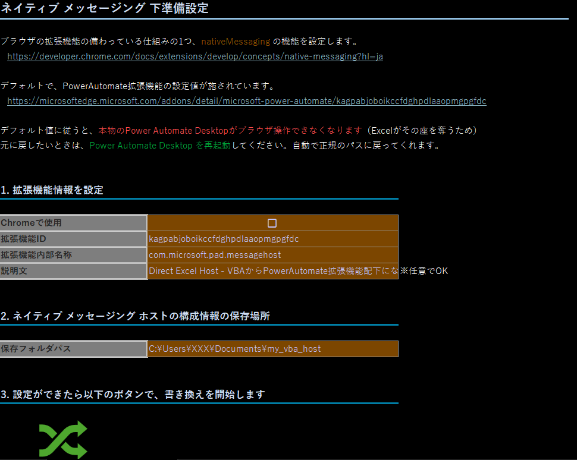

実際にこの「黒魔術」がどんな挙動をするのか試してみたい猛者は、以下の手順で環境を準備してください。

### Step 1: ファイルの準備

[リリースページ](https://github.com/Eschamali/WebScrapingByNativeMessaging/releases)から本マクロブックをダウンロードし、任意のフォルダに配置します。

> [!CAUTION]
> インターネットから取得したマクロファイルのため、実行前にファイルのプロパティから「許可する（Mark of the Web の解除）」にチェックを入れてください。

### Step 2: ターゲットブラウザの選択


マクロを開き、ツール内の設定でChromeをターゲットにする場合は 「Chromeで使用」 のオプションをONにしてください。（Edgeの場合はOFFです）

### Step 3: マニフェストの出力先指定

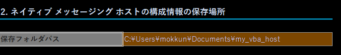

ツール画面上で、ブラウザとの橋渡しになる「マニフェストファイル（JSON）」および「中継バッチファイル（.bat）」を保存するためのフォルダパスを「保存フォルダパス」項目に指定します。

### Step 4: レジストリハックの実行

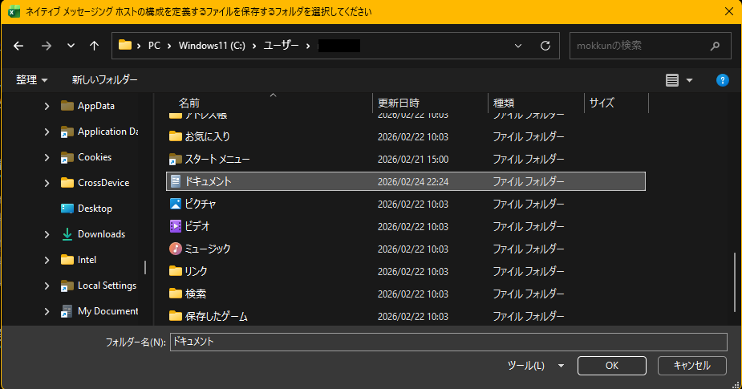

シート上の上記ボタンを押下します。これにより、裏側でレジストリの偽装とマニフェストの生成が行われます。

### Step 5: 拡張機能との「結び付け」

成功するとメッセージボックスが表示されます。

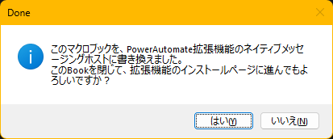

「はい」を押下すると、本Excelツールは一旦自動的に閉じられ、ターゲットである「Power Automate拡張機能」のインストール用Webページが開きます。

> [!IMPORTANT]
> * Windowsの「既定のブラウザ」設定により、対象外のブラウザ（例：Chromeで使いたいのにEdgeが開く等）が立ち上がることがあります。その際は、開いたURLをコピーして正しいブラウザでインストールを進めてください。
> * **既に拡張機能を入れている場合**  
> ブラウザに新しいマニフェスト（レジストリ）を認識させるため、拡張機能の管理画面から 「一旦OFFにしてからONにする」 か、「一度削除して再インストール」 を必ず行ってください。

### Step 6: 魔法の瞬間（準備完了）

手順5の拡張機能の有効化が正しくブラウザに認識されると……  
驚くことなかれ、先ほど閉じたはずのExcelツールが、ブラウザからの呼び出しによって勝手に再起動します。

> [!NOTE]
> これがネイティブ メッセージングの仕様挙動です🙂  
> 見た目は何の変哲もないいつものExcelブックですが、背後ではブラウザの中枢とパイプ通信でガッチリ直結されています。これで準備完了です😋

## 🎬 デモコードの実行（魔法の証明）

ただExcelの画面を見ているだけでは面白くありません。  
実行する前に以下の準備を済ませておくと、 **「あ、ブラウザとExcelが本当に裏で喋ってる……！」** という感動をリアルタイムで味わうことができます。

### 事前準備：ブラウザの「脳内」を覗き見する

1. ブラウザの拡張機能管理画面（Chromeの場合は chrome://extensions/）を開きます。
2. 左側のの「デベロッパーモード」がONになっていることを確認します。
 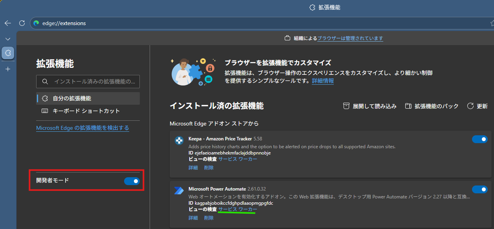

3. Power Automate拡張機能のパネルにある 「サービス ワーカー（Service Worker）」 という青い文字をクリックします。
4. 別ウィンドウで開発者ツール（DevTools）が開くので、「Console（コンソール）」 タブを開いて待機させておきます。  
   初期状態は、下記の画像のように、2行分が表示されていると思います。
   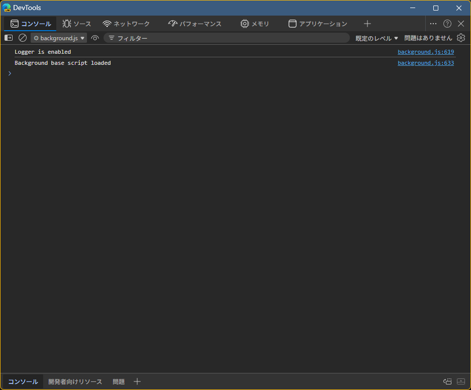

## 🚀 いざ、通信開始！

1. マクロブックに戻り、キーボードの Alt + F8 を押下します。マクロの実行ダイアログが表示されます。
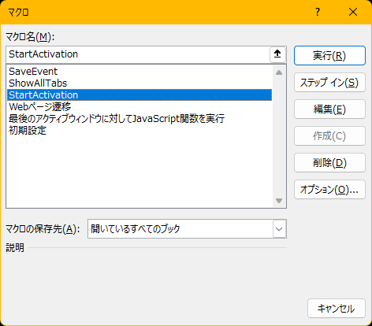
2. リストの中から`StartActivation`を選択し、「実行」ボタンを押下します。

### 👉 サービスワーカーのコンソールを見てください！

静かだったコンソール画面に、何やらログなどの反応が出力されたはずです😗
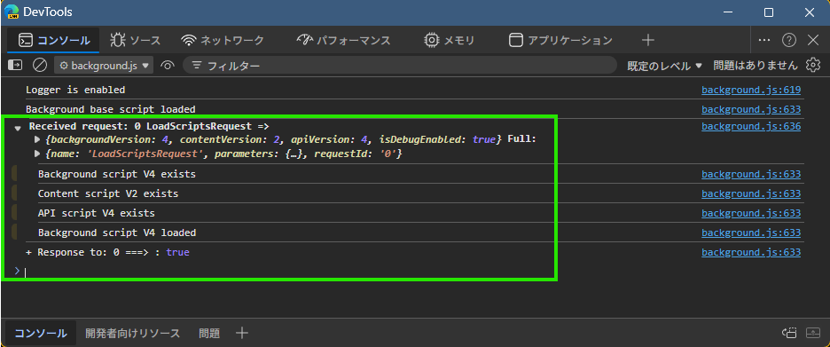

### 【内部で何が起きているか？】

この時、VBAの裏側では`LoadScriptsRequest`というコマンド（JSON）がパイプを通じてブラウザに叩き込まれています。  
ブラウザ側が「Excelから何か命令が飛んできたぞ！」と反応した決定的な証拠です。

## 🧪 デモコードの実行（概念実証）

本マクロブックには、概念実証（PoC）として2つのDemoコードを用意しています。  
非常にシンプルな処理のみですが、ネイティブ メッセージングの通信プロトコルを理解し、ここから独自の自動化ツールへ発展させるための基礎資料としては十分なはずです。  
※まぁ、そもそも「他社の製品（拡張機能）を間借りしてわざわざWeb操作する」なんて狂ったシチュエーションは実務では早々ないので、これ以上の発展は多分ないと思いますが🫥

### 🌐 Demo 1：既存タブの「狙い撃ち」ページ遷移

現在開いている指定のURLタブを探し出し、別のURLへ強制的に遷移させます。

1. ターゲットURLの設定
VBE（Visual Basic Editor）を開き、DemoPAD モジュール内の Webページ遷移 プロシージャを探します。  
以下の定数部分に、「今あなたのブラウザで実際に開いている適当なタブのURL」 をコピペしてください。  
あるいは、[ここ](https://news.google.com/home?hl=ja&gl=JP&ceid=JP:ja)をクリックして、Google Newsサイトを開いて用意しても構いません
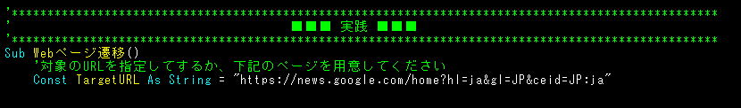

2. マクロの実行  
設定ができたら、該当のマクロを実行します。

**【結果】**  
VBAが通信パイプ経由でブラウザ内の全タブを走査し、定数 TargetURL に一致するタブを発見します。  
そしてそのタブの画面を、[Chrome for Developers のネイティブ メッセージング公式ヘルプドキュメント](https://developer.chrome.com/docs/extensions/develop/concepts/native-messaging?hl=ja)へと切り替えます。

> [!TIP]
> WebDriverやCDP（Chrome DevTools Protocol）を使い慣れたエンジニアから見れば、単なるページ遷移なんて「当たり前」に見えるかもしれません。  
> でも、ある決定的な違いに気づくはずです🙂
> * **WebDriver / CDPの場合**  
>   自動化を始めるためには、必ず「専用のコマンドライン引数を付けた真っ新なブラウザ」を新規プロセスで立ち上げるか、事前にデバッグポートを開けて起動し直すという **「新規立ち上げ儀式」** が必須です。
> * **拡張機能ルート（本PoC）の場合**  
>   「今あなたが普通に使って、すでにいくつもタブを開いている目の前のブラウザ」 を、なんの事前準備もなくいきなりハイジャックして操作の起点にできてしまいます。
> 
> これこそが、泥臭いレジストリ偽装やバッチファイルの壁を越えて手に入れた、このルート唯一にして最大の機能的優位性なのです😋

<details>
<summary>ということは...閲覧注意</summary>

このプロシージャで使われている通信構造（`GetAllTabsRequest` でタブ一覧を取得し、`NavigateToUrlRequest`で指定タブを遷移させる）を少し書き換えるだけで、例えば以下のようなことも理論上可能です。
* 「現在開いているすべてのタブを、強制的に同じページ（例えば Rickroll など）に置き換える」 😱

これはマルウェアやイタズラウイルスに近い凶悪な挙動ですが、ブラウザ拡張機能の権限（tabs API）を直接叩いている以上、ブラウザ側からは「正規の命令」として何の警告もなく即座に実行されてしまいます。

※当然ながら、本リポジトリにそのような危険なコードは記述していません。  
プロトコルの仕組みを理解できた方なら、自力でどう書き換えれば実現できるか想像がつくはずです。あくまで自己責任の範囲内での学習にとどめてください。
</details>

### 💉 Demo 2：非同期イベントの「傍受」とJavaScript実行

最後は、ブラウザの「最後のアクティブウィンドウ」を特定し、そこに対して任意のJavaScript（今回は分かりやすく`alert`）を流し込んで〆ようと思います。

#### ブラウザの「独り言」を傍受する

ブラウザのウィンドウをアクティブにする（マウスでクリックして手前に持ってくる等）と、Power Automate拡張機能のサービスワーカーは裏側で以下のようなログを吐き出しています。

```js
===> Sending message
▶ WindowFocusedChangedNotification {notify: 'window focused', name: 'notify', requestId:'', windowId: 185543562}
```

<details>
<summary>DevTools上の画像はこちら</summary>

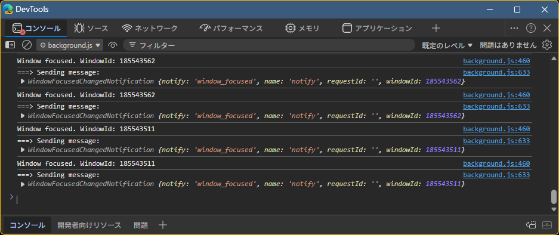
</details>

これはCDPやWebDriver BiDiなどでおなじみの **「非同期イベント」** です。  
ブラウザ側から「今、このウィンドウにフォーカスが当たったよ！」と、わざわざパイプに向かって教えてくれているわけです。

今回のデモでは、自分から「どこのウィンドウ？」と尋ねるのではなく、パイプの中に残留しているこの非同期イベント`WindowFocusedChangedNotification`の通知をキャプチャして windowId を引っこ抜き、そこへ向けてJavaScript実行コマンドを叩き込みます。

#### 【実行手順と注意点】

このデモは「パイプに通知が残っていること」を前提とするため、実行前に少しだけ儀式が必要です。

1. **イベントを発生させる**  
適当にいくつかブラウザのウィンドウやタブをクリックして、意図的にアクティブ状態を切り替えてください。（※これにより、先ほどの非同期イベントがパイプ内に送信・蓄積されます）

2. **マクロの実行**  
VBEあるいは、「alt + F8」から`最後のアクティブウィンドウに対してJavaScript関数を実行`プロシージャを実行します。

#### 【結果と仕様のトラップ】
* **ウィンドウが1つの場合**  
  そのウィンドウのアクティブタブでJavaScriptが実行されます。

* **ウィンドウが複数ある場合**  
  あなたが「一番最後にクリックした（アクティブにした）」ウィンドウの表示中タブで実行されます。  

> [!WARNING]
> パイプに残っているイベント情報を読み取るため、もし事前にブラウザを一度もクリックしておらず、パイプが空っぽの場合は処理に失敗します🫥(ブラウザウィンドウが1つの場合を除く)

> [!CAUTION]
> マクロが成功すると、対象のブラウザ上部にメッセージボックス（alert）が表示されます。  
> しかしブラウザの仕様上、この alert の「OK」ボタンを押すまでJavaScriptの処理が一時停止し、拡張機能からVBAへの「コマンド完了通知」が返ってきません。  
> 放置するとVBA側でタイムアウトエラーが発生して死ぬので、ドヤ顔でアラートを眺めるのは数秒にとどめ、なるべく早く「OK」を押してあげてください🥺

## 👑 最終章：【真・PAD方式】名前付きパイプによるアーキテクチャ完全再現 (The Ultimate PoC)

本PoCの最終到達点として、実際の製品版「Power Automate Desktop (PAD)」が内部で採用している3層アーキテクチャの完全再現を行いました。

これまでのデモは「Excel(Host) ⇔ ブラウザ」の2層構造でしたが、ここではさらに外側に「司令塔」となる別のアプリケーション（今回はWord VBAを使用）を配置し、 **プロセス間通信（IPC）** を用いて遠隔操作を行います。

### 🏗️ 構築した3層アーキテクチャの全容

* **製品版PADの構造】**  
`PAD本体` ==(名前付きパイプ)==> `PAD.BrowserNativeMessageHost.exe (仲介役)` ==(匿名パイプ)==> `ブラウザ`

* **【本PoCの最終形態】**  
`Word VBA (司令塔)`==(名前付きパイプ)==> `Excel VBA (自作Host)` ==(匿名パイプ)==> `ブラウザ`

異なるアプリケーション（WordとExcel）を、OSの深淵たる **名前付きパイプ（Named Pipes）** で直結し、独自の「やり取りのルール（プロトコル）」でチャットさせるという、狂気とロマンの構成です。

### 💻 実行プロセス（チャットの原点を見る）

> [!NOTE]
> VBAはシングルスレッドのため、非同期でのパイプ待機を行うと発狂（フリーズ）します。  
> そのため、本概念実証ではあえて **「手動で1ステップずつWinAPIを叩いて通信のキャッチボールを行う」** という、極めてプリミティブ（原始的）な同期ステップを採用しています。

実行手順は以下の通りです。ウィンドウを2つ並べて、プロセス同士が「会話」する瞬間を見届けてください。

1. WordのVBE を開き、[このコード](VBAProject\Modules\DemoConnectPipeWithNameForWord.bas)を丸ごとモジュールへコピペしてください
2. **[Host側] パイプの開設 (Excel)**  
Excel側で`CreateNamedPipe`APIを実行し、サーバーとして待機します。

> [!IMPORTANT]
> この瞬間、Excelはクライアントが来るまでフリーズします

```bas
' --- 0. パイプ開設と接続待ち ---
Sub Step0_OpenServer()
    ' パイプを作成
    hPipe = CreateNamedPipe(PIPE_NAME, PIPE_ACCESS_DUPLEX, PIPE_TYPE_BYTE Or PIPE_WAIT, 1, 1024, 1024, 0, 0)
    If hPipe = INVALID_HANDLE_VALUE Then
        MsgBox "パイプの作成に失敗しました??", vbCritical
        Exit Sub
    End If
    
    Debug.Print "パイプを開設しました。Wordからの接続を待っています..."
    
    ' ★注意★ ここでExcelはWordが繋いでくるまで「フリーズ（待機状態）」になります！
    ConnectNamedPipe hPipe, 0
    
    ' Wordが繋ぐとフリーズが解けてここに進む
    Debug.Print "Wordが接続してきました！"
End Sub
```

3. **[Client側] 接続と命令の送信 (Word)**  
Word側から`CreateFile`でExcelのパイプに接続し、`WriteFile`で「URL遷移をお願い！」というテキストを流し込みます。

> [!TIP]
> 繋がった瞬間にExcelのフリーズが解け、通信が確立します

```bas
' --- 1. Excelに接続して命令を送る ---
Sub Step1_ConnectAndSend()
    ' Excelが開設したパイプに接続
    hPipe = CreateFile(PIPE_NAME, GENERIC_READ Or GENERIC_WRITE, 0, 0, OPEN_EXISTING, 0, 0)
    
    If hPipe = INVALID_HANDLE_VALUE Then
        MsgBox "Excelのパイプが見つかりません。Step0を実行しましたか？", vbCritical
        Exit Sub
    End If
    Debug.Print "Excelのパイプに接続成功！"
    
    ' Excelに命令を送る
    Dim commandMsg As String
    commandMsg = "URL遷移をお願いします！"
    
    Dim buffer() As Byte
    Dim bytesWritten As Long
    buffer = StrConv(commandMsg, vbFromUnicode)
    
    WriteFile hPipe, buffer(0), UBound(buffer) + 1, bytesWritten, 0
    Debug.Print "Excelに命令を送信しました！"
End Sub
```

4. **[Host側] 命令の受信と翻訳 (Excel)**  
ExcelがWordからのメッセージを受信し、それをネイティブ メッセージング用のJSONフォーマット（4バイトヘッダ付き）に翻訳して、今度はブラウザへ向けて（匿名パイプ経由で）発射します。

```bas
' --- 2. Wordからの命令を受信 ---
Sub Step2_ReceiveFromWord()
    Dim buffer(0 To 1023) As Byte
    Dim bytesRead As Long
    Dim msg As String
    
    ' Wordからのメッセージを読み取る（文字が来るまで待機）
    ReadFile hPipe, buffer(0), 1024, bytesRead, 0
    
    If bytesRead > 0 Then
        ' バイト配列を文字列に変換 (UTF-8等ではなく手抜きでShift-JIS変換)
        msg = StrConv(LeftB(buffer, bytesRead), vbUnicode)
        Debug.Print "Wordからの命令: " & msg
        ' セルに書き出してもOK！
    End If
End Sub
```

5. **[Host側] ブラウザからの応答と返信 (Excel)**  
ブラウザを操作し終えたら、その結果を再度Wordへ向けて WriteFile で送り返します。

```bas
' --- 3. ブラウザへ送信 ＆ 4. Wordへ結果を返す ---
Sub Step3and4_SendResultToWord()
    ' 【本来のStep3】 ここで受け取った命令(msg)をもとに Select Case 等で
    ' ネイティブメッセージングの SendMessage / ReceiveMessage を行います。
    ' Call Webページ遷移
    ' 今回は概念実証なので、モック（ダミー結果）を作ります。
    
    Dim resultMsg As String
    resultMsg = "ブラウザ操作完了！(Excelより愛を込めて)"
    
    Dim buffer() As Byte
    Dim bytesWritten As Long
    buffer = StrConv(resultMsg, vbFromUnicode)
    
    ' Wordへ結果を送信！
    WriteFile hPipe, buffer(0), UBound(buffer) + 1, bytesWritten, 0
    Debug.Print "Wordへ結果を返しました！"
    
    ' 最後にパイプをお片付け
    ' ※Wordで受信後、続行すること
    Stop
    DisconnectNamedPipe hPipe
    CloseHandle hPipe
End Sub
```

> [!NOTE]
> Demoコードでは、脳内補完扱いとします。

6. **[Client側] 結果の受領 (Word)**  
WordがExcelからの完了報告を受け取り、メッセージボックスを表示してミッションコンプリートです。

```bas
' --- 5. Excelからの結果を受け取る ---
Sub Step5_ReceiveFromExcel()
    Dim buffer(0 To 1023) As Byte
    Dim bytesRead As Long
    Dim resultMsg As String
    
    ' Excelからの返信を待つ
    ReadFile hPipe, buffer(0), 1024, bytesRead, 0
    
    If bytesRead > 0 Then
        resultMsg = StrConv(LeftB(buffer, bytesRead), vbUnicode)
        MsgBox "Excelからの報告: " & vbCrLf & resultMsg, vbInformation, "ミッション完了"
    End If
    
    ' パイプをお片付け
    CloseHandle hPipe
End Sub
```

> [!IMPORTANT]
> Excel側の`Stop`開放も忘れずに...

各イミディエイトウィンドウには、下記のように出るはずです
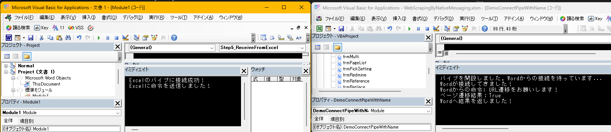

## ❓ よくある質問とトラブルシューティング (Q&A)

### ハイジャックを解除して、本来のPower Automate（`PAD.BrowserNativeMessageHost.exe`）に戻すにはどうすればいい？

Power Automate Desktop (PAD) 本体を再起動するだけです！  
実はPADには「起動時に自身のレジストリパスが改ざんされていないかチェックし、勝手に正規のパスへ修復する」というお節介（今回に限っては非常にありがたい）機能が備わっています。PADを再起動するだけで、私たちが書き換えた黒魔術レジストリは綺麗に浄化されます😋

### なんかこのExcelツール、×ボタンで閉じてもゾンビのように勝手に再復活してくるんだけど…😱

Power Automate拡張機能側の「執念深い仕様」が原因です。  
拡張機能のバックグラウンドプロセスは「ホスト（中継役）との通信が切れたら、即座に再起動して通信を維持する」ように設計されています。そのため、Excelを閉じてもブラウザ側が「あ、ホストが死んだ！生き返らせなきゃ！」と即座に魔法を詠唱してしまいます。

この無限ループ（ゾンビ化）から抜け出し、完全に元の平和な環境に戻すには、以下の「除霊ステップ」を踏んでください。

1. 召喚を止める: ブラウザの拡張機能管理画面を開き、Power Automate拡張機能を一旦 「OFF（無効）」 にします。
2. 呪いを解く: Power Automate Desktop 本体を再起動します。（Q1の通り、これでレジストリが正規のパスに修復されます）
3. 正規ルートの開通: 再度、ブラウザ側でPower Automate拡張機能を 「ON（有効）」 に戻します。

これで、次からは本来の`PAD.BrowserNativeMessageHost.exe`が正常に呼び出され、製品版のPADが何事もなかったかのように機能するようになります！🫠

## 最後に

なぜWebDriverを使えば数行で終わる処理を、わざわざ数百行のWinAPIとレジストリ偽装、そして黒魔術バッチを駆使して実装したのか？  
答えはシンプルです。 **「今開いている目の前のブラウザを直接操りたいから」** です🫠

実務において、このツールが火を噴く（色々な意味で）ことは恐らく永遠にありません。おとなしくSeleniumやCDPを使ってください。  
しかし、OSの深淵を覗き込み、他社の拡張機能の通信プロトコルをVBAから完全に「ハイジャック」したこの経験は、公式APIを優等生に叩いているだけでは絶対に得られない最高の「概念実証」でした。

それでは、狂気とロマンに満ちた素晴らしいVBAハックライフを！😋
